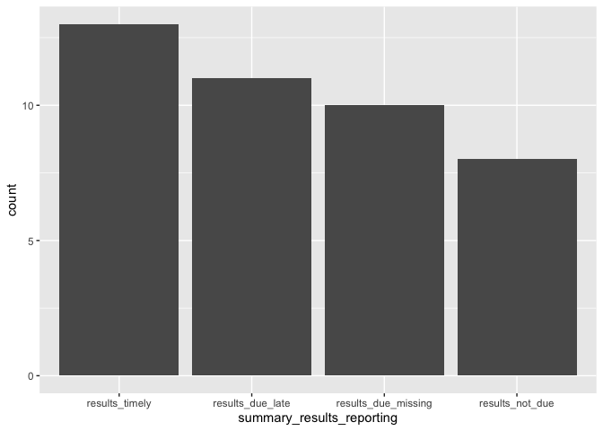

<!-- README.md is generated from README.Rmd. Please edit that file -->

# Trials at The Neuro (Montreal Neurological Institute-Hospital)

Latest AACT query: 2023-11-11

``` r
trials <- readr::read_csv(here::here("data", "processed", "combined-ctgov-studies.csv"))
#> Rows: 162 Columns: 29
#> ── Column specification ────────────────────────────────────────────────────────
#> Delimiter: ","
#> chr  (10): nct_id, source, study_type, phase, recruitment_status, title, all...
#> dbl   (5): enrollment, registration_year, start_year, completion_year, days_...
#> lgl   (6): has_summary_results, is_multicentric, is_prospective, results_due...
#> dttm  (3): start_date, completion_date, primary_completion_date
#> date  (5): last_update_submitted_date, registration_date, summary_results_da...
#> 
#> ℹ Use `spec()` to retrieve the full column specification for this data.
#> ℹ Specify the column types or set `show_col_types = FALSE` to quiet this message.
```

“combined-ctgov-studies.csv” contains 162 ClinicalTrials.gov
registrations, limited to trial registration numbers provided by McGill
(excluding trials found only via AACT query).

# Prospective registration

``` r
trials_pr <-
  trials |> 
  filter(
    study_type == "Interventional",
    !is.na(start_date)
  )

trials_pr |> count(is_prospective)
#> # A tibble: 2 × 2
#>   is_prospective     n
#>   <lgl>          <int>
#> 1 FALSE              5
#> 2 TRUE             137
```

Of 142 interventional trials with a start date available, 137 are
registered prospectively.

# Trial results reporting in the registry

``` r
trials_sr <-
  trials |> 
    filter(
    study_type == "Interventional",
    recruitment_status == "Completed",
    !is.na(primary_completion_date)
  ) |> 
  mutate(
  summary_results_reporting = factor(summary_results_reporting, levels = c("results_timely", "results_due_late", "results_due_missing", "results_not_due"))
  )

trials_sr |> count(summary_results_reporting)
#> # A tibble: 4 × 2
#>   summary_results_reporting     n
#>   <fct>                     <int>
#> 1 results_timely               13
#> 2 results_due_late             11
#> 3 results_due_missing          10
#> 4 results_not_due               8

trials_sr |> 
  ggplot(aes(x = summary_results_reporting)) +
  geom_bar()
```

<!-- -->

Of 42 interventional trials with a completed status and a primary date
available, 13 reported timely summary results in the registry.

# Link in registration to publication

``` r
trials_links <-
  trials |> 
    filter(
    study_type == "Interventional",
    recruitment_status == "Completed"
  )

trials_links |> count(has_linked_reference)
#> # A tibble: 2 × 2
#>   has_linked_reference     n
#>   <lgl>                <int>
#> 1 FALSE                   18
#> 2 TRUE                    24
```

Of 42 interventional trials with a completed status, 24 have at least
one linked reference. This includes results, background, and references
automatically derived from PubMed.
